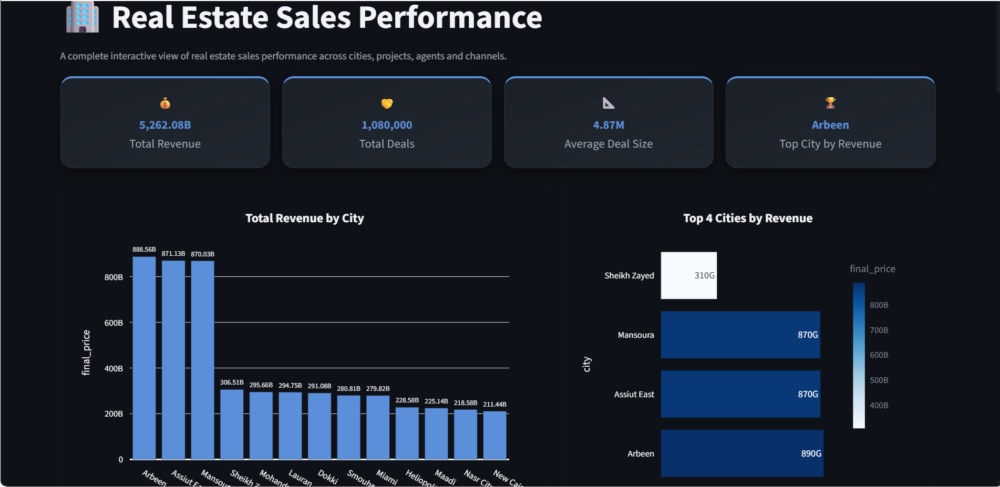
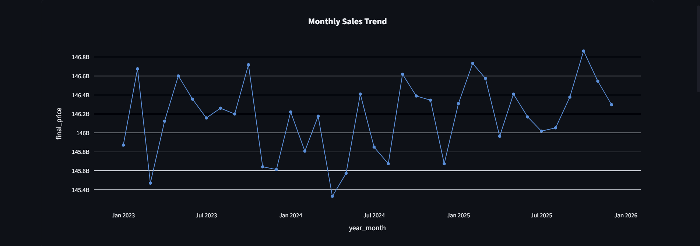
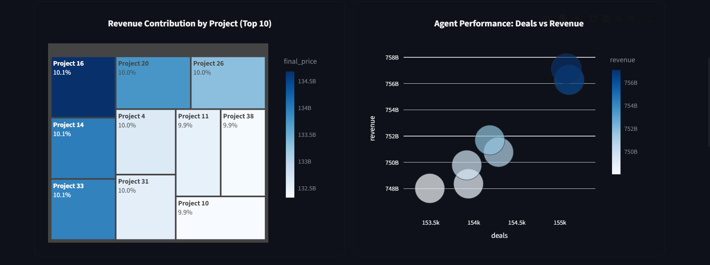
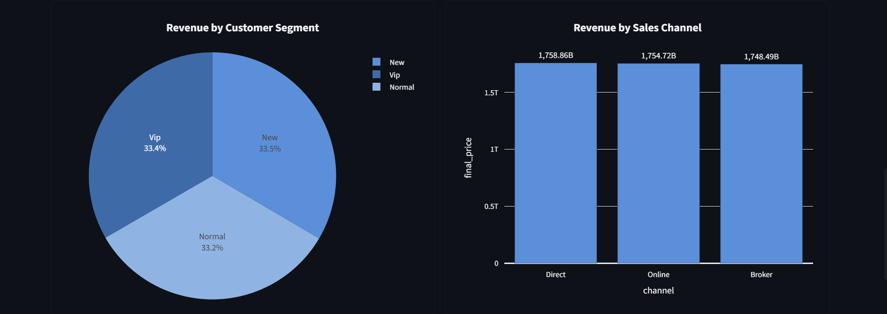
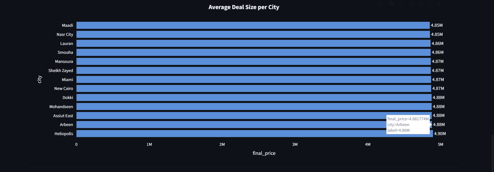
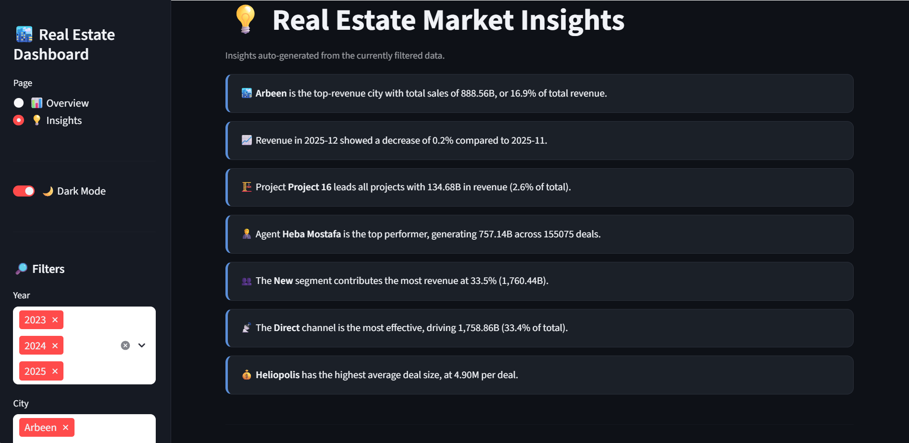
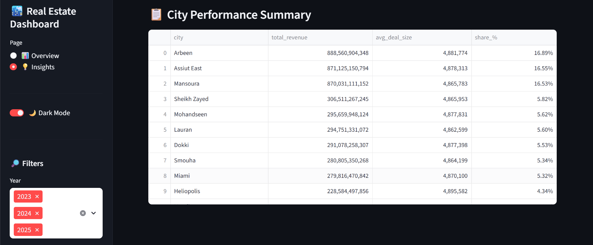

# 🏙️ Real Estate Sales & Market Intelligence Dashboard


> **An end-to-end data engineering, Exploratory Data Analysis (EDA), and interactive web dashboard solution analyzing real estate transactions (2023–2025).**

---
## 🚀 Project Overview
This project presents an end-to-end data engineering, Exploratory Data Analysis (EDA), and interactive web dashboard solution for a real estate sales enterprise covering the years **2023–2025**. The pipeline ingests 36 individual monthly transactional files alongside core customer and project dimension tables, performs rigorous data cleaning, feature engineering, and relational merging, and serves the insights through a high-performance **Streamlit** web application styled with professional **Plotly** visualizations.

**Industry:** Real Estate Development & Property Marketing

---
## 📈 Dashboard Preview
Here is a complete visual walkthrough of the interactive **Streamlit** dashboard pages and analytics:















--- 
### **Project Architecture & Tech Stack**
* **Data Processing & Manipulation:** `Pandas`, `NumPy`
* **Geospatial & Text Normalization:** `Regular Expressions (Regex)` for PII and phone/address parsing
* **Interactive Visualization:** `Plotly` (Express & Graph Objects)
* **Web Application Framework:** `Streamlit` (featuring custom responsive CSS, theme state management, and containerized UI layout)

---

### **Data Architecture & Core Data Structures**
The dataset is built upon a robust relational architecture consolidated into a unified Master Table (**1,080,000+ transactions**, 44 columns):
1. **Fact Table (Sales Transactions):** Consolidated from 36 monthly CSV files (`sales_2023_01.csv` through `sales_2025_12.csv`). Tracks individual property sales, unit pricing, discounts, final transaction values, down payments, payment plans, sales channels, and assigned agents.
2. **Dimension Table 1 (Projects):** Contains structural data on real estate developments across 40 projects (`project_id`, `project_name`, `location`, `developer`, `project_type`, `start_price`, `max_price`, `units_count`, `delivery_year`, and `status`).
3. **Dimension Table 2 (Customers):** Encompasses demographic and CRM data for **30,000 customers** (`customer_id`, `full_name`, `phone`, `email`, `address`, `customer_type`, `lead_source`, `budget_range`, `created_at`, `sales_agent`, and `segment`).

---

### **Workflow & Pipeline Breakdown**

#### **Phase 1 & 2: Sales Data Preparation & Feature Engineering**
* **Automated Ingestion:** Iterated through the `salesmonths` directory to dynamically load and concatenate 36 monthly `.csv` files into a unified dataframe (**1,080,000 rows × 13 columns**).
* **Data Validation & Deduplication:** Validated transaction uniqueness using `sale_id` to prevent double-counting.
* **Temporal Parsing:** Converted `sale_date` into datetime objects and extracted distinct temporal dimensions (`year`, `month`, `month_name`).
* **Text Uniformity:** Applied string stripping and title-casing across categorical columns (`unit_type`, `payment_plan`, `channel`, `agent`, `status`).
* **Advanced Feature Engineering:**
  * Derived quantitative `payment_years` by parsing alphanumeric payment plans (e.g., converting `'8Y'` to `8` and `'Cash'` to `0`).
  * Calculated the exact `down_payment_pct` relative to unit prices.

#### **Phase 3: Projects Dimension Cleaning & Segmentation**
* **Anomaly Filtering:** Removed logical outliers (e.g., records where starting prices exceeded maximum prices, or projects with zero/negative unit inventories).
* **Valuation Metrics:** Engineered `price_range` (max price minus start price) and `avg_price` as standardized valuation baselines.
* **Price Categorization:** Segmented projects into clean pricing tiers (`Low`, `Medium`, `High`) using `pd.cut`.
* **Taxonomy Standardization:** Unified bilingual project statuses into a clean business taxonomy (`Delivered`, `Under Development`, `Under Construction`).

#### **Phase 4: Customer Dimension Cleaning & Geospatial Normalization**
* **PII Sanitization:** Sanitized emails (lowercase/strip) and standardized phone formats using Regular Expressions (`\D` pattern matching).
* **Categorical Translation:** Translated bilingual Arabic categorical entries (`customer_type`, `lead_source`) into a unified English taxonomy (`Individual`, `Company`, `WhatsApp`, `Referral`, etc.).
* **Geospatial Tuple Mapping:** Developed a robust dictionary-based mapping function (`address_map`) to parse unstructured Arabic and English address strings, successfully extracting clean, standardized `city` and `governorate` columns (e.g., parsing diverse inputs into core hubs like New Cairo, Nasr City, Sheikh Zayed, Mansoura, and Smouha).

#### **Phase 5 & 6: Data Integration (OBT) & Exploratory Data Analysis (EDA)**
* **Denormalization:** Executed left joins across the Fact table and Dimension tables (`sales` + `customers` + `projects`) to produce the final **Master Dataset (`sales_full_dataset.csv`)**.
* **Visual Analytics (DataVis Script):** Programmed comprehensive Plotly visualizations to evaluate geographic revenue distribution, monthly sales growth trends, project contributions, sales channel efficiency, agent performance matrices, and customer segment penetration.

---

### **Streamlit Dashboard Architecture (`app.py`)**

The interactive Streamlit application is organized into two primary analytical views:
1. **📊 Overview Page:**
   * **Executive KPI Cards:** High-impact metrics displaying **Total Revenue** (formatted in Billions), **Total Deals**, **Average Deal Size**, and **Top City by Revenue**.
   * **Geographic Analytics:** Bar charts displaying total revenue by city and top-performing regional hubs.
   * **Time-Series Analysis:** Line charts with interactive markers illustrating monthly revenue trajectories across 2023–2025.
   * **Project & Agent Performance:** Proportional Treemaps showcasing top revenue-generating projects (Top 10) and scatter/bubble charts evaluating agent efficiency (deals closed vs. revenue generated).
   * **Customer & Channel Insights:** Pie charts breaking down revenue distribution across customer segments (New, Normal, VIP) and bar charts comparing direct, online, and broker sales channels.
2. **💡 Insights Page:**
   * **Automated Text Intelligence:** Dynamically generates natural-language executive summaries highlighting key market drivers, top cities, leading agents, and month-over-month growth patterns based on active sidebar filters.
   * **Comprehensive Data Table:** Provides an interactive summary table of city-level metrics (Total Revenue, Share %, Average Deal Size).

---
## 📂 Repository Structure
| File / Folder | Description |
| :--- | :--- |
| `app.py` | **Interactive App.** The core Streamlit web application script. |
| `notebooks/Test.ipynb` | **ETL & Data Engineering.** Handles 36-file batch ingestion, data cleaning, regex PII sanitization, and geospatial tuple mapping. |
| `notebooks/DataVis.ipynb` | **Exploratory Data Analysis (EDA).** Houses the Plotly visualization logic and statistical exploration. |
| `assets/` | **Media.** Stores dashboard screenshots and UI previews. |
| `requirements.txt` | **Dependencies.** Lists all required Python libraries. |

---

### ⚙️**How to Run the Application Locally**

1. Clone the repository and navigate to the project directory:
   ```bash
   git clone https://github.com/Sarah-Qw/real-estate-sales-dashboard.git
   cd real-estate-sales-dashboard
   
2. **Install Dependencies:**
   ~~~bash
   pip install -r requirements.txt
   ~~~

3. **Acquire Data:** 
   Download `sales_full_dataset.csv` from this [Google Drive Link](ضع_رابط_قوقل_درايف_هنا) (Data is not hosted here due to GitHub's size constraints). Place the downloaded file directly into the root directory of the project.

4. **Run Pipeline (Optional):** 
   Execute `notebooks/Test.ipynb` to review the ETL pipeline, data cleaning, and how the raw 36 monthly logs were processed and merged.

5. **Explore Dashboard:** 
   Run the following command to launch the interactive web application:
   ~~~bash
   streamlit run app.py
   ~~~

---
## 📜 License

Distributed under the MIT License. See `LICENSE` for more information.
